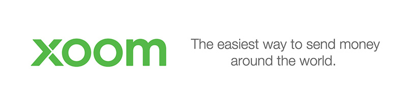

# Introdução

Trabalhar remotamente vem se tornando cada vez mais um objetivo de todos os trabalhadores na área de TI ao redor do mundo. Estar alinhado com suas necessidades, controlar seu horário de trabalho, dispor de mais tempo com a família, viajar e conhecer novos horizontes e principalmente se livrar do stress causado pelo trânsito nas grandes cidades. Estes são alguns dos motivos que fazem um funcionário questionar sua empresa e negociar uma jornada de trabalho remoto.

Após completar 2 anos de trabalho remoto, decidi compartilhar um pouco da minha experiência relativa a como começar a trabalhar remotamente tanto para empresas no Brasil, quanto para empresas no exterior.

Todas as informações são inicialmente focadas a profissionais de TI, porém também podem ser aplicadas a profissionais de outras áreas.

# Trabalho remoto é a coisa certa para você?

Algo que percebi trabalhando com várias pessoas, de vários estados e países, foi que cada um tem suas características as quais fazem você se dar bem ou não no trabalho remoto:

- Disciplina

	É bem difícil controlar sua atenção quando se tem milhares de problemas, serviços domésticos para fazer, cachorro para dar banho, filhos para levar na escola e outras coisas do tipo. Se você é do tipo que procrastina seu trabalho para resolver seus problemas de forma desorganizada, talvez trabalho remoto seja difícil para você.

- Motivação

	Às vezes fica difícil acordar cedo, estar disponível para uma reunião, ou até mesmo se sentir lento por não ter ninguém te ajudando pessoalmente. Pessoas com auto-motivação fazem um trabalho remoto melhor. Às vezes é realmente necessário um  Gestor de projetos pegando no pé para manter os funcionários focados no trabalho.

- Local de trabalho

	O local de trabalho é muito importante para quem trabalha remoto. Às vezes por achar que a liberdade é grande, você acaba caindo na tentação de trabalhar na cama, às vezes até caindo no sono, ligar a TV e trabalhar enquanto assiste, ser atrapalhado por inteferências familiares como esposa pedindo pra ir fazer compras no supermercado. Às vezes é realmente necessário definir um bom local de trabalho no qual você se sinta na obrigação de, ao sentar para trabalhar, estar focado e esquecer o máximo do ambiente externo que pode tirar seu foco.

- Personalidade

	Algumas pessoas conseguem trabalhar tranquilamente em sua casa, outras, necessitam de um escritório específico pra isso, onde conseguem ter contato com outros profissionais. Existem pessoas que utilizam essa oportunidade de trabalho para viajar pelo mundo virando 'nômades digitais'.

# Necessidades

Inicialmente tudo que você precisa é ter seus instrumentos de trabalho, "computador, smartphone (caso seja desenvolvimento mobile), post-it(<3)", um lugar para plugar a tomada do seu computador e uma boa internet. Para algumas empresas também é necessário que fique sempre online em alguma ferramenta de comunicação determinada pela empresa.

# Contratação

Para empresas no Brasil, você pode continuar com o modelo CLT ou PJ normalmente, mesmo não residindo no estado da empresa, embora seja necessário ir algumas vezes visitar a empresa para resolver burocracias. Para empresas no exterior é recomendado que você tenha um contrato de prestação de serviços, já que você não é diretamente contratado no modelo formal. Este contrato irá comprovar a origem e legalidade do dinheiro que você irá receber.

# Formas para receber dinheiro

Aqui vem uma das partes mais importantes, que além de garantirem toda a segurança do processo, podem lhe ajudar de algumas maneiras na hora de declarar todo o imposto referente ao valor recebido.

## Paypal

O primeiro e mais conhecido por todos é o [Paypal](https://www.paypal.com), embora MUITAS pessoas falem de histórias, medos ao usar para receber pagamentos do exterior e coisas do tipo... É uma ferramenta muito boa, segura e eficiente. Existem alguns relatos de pessoas que tiveram problemas e todo o seu dinheiro foi congelado sem volta. O que eu tenho a dizer sobre isso é: Tome cuidado com a empresa que você está fazendo negócio, é justamente ela que pode bloquear ou criar uma disputa pelo seu pagamento.

É possível ter uma conta facilmente no Brasil. Porém você só pode cadastrar cartões Brasileiros. Caso você tenha conta nos EUA, é necessário ter uma conta extra de Paypal para trabalhar e transitar facilmente o dinheiro com mais regalias.  É necessário lembrar que ter uma conta nos EUA não significa que você legalmente pode receber dinheiro de empresas sem permissão para trabalho, então pense duas vezes.

## Xoom

[Xoom](https://www.xoom.com) é um dos mais adorados por todos os freelancers, é tão simples que parece até não ser de verdade. A empresa efetua o envio do dinheiro e cai direto na sua conta, geralmente no mesmo dia, em algumas horas. Trata-se de um intermediador de envios entre países, onde a empresa que lhe contratou paga o valor na sua moeda nacional e você recebe em reais na sua conta.

Depois de se cadastrar, a empresa pode enviar até US$ 2.900 dentro de um período de 24 horas, até US$ 6.000 dentro de 30 dias e até US$ 9.999 em 180 dias. Os limites de envio aplicam-se às atividades combinadas de todas as contas que tenham o mesmo endereço físico. Por esse motivo, a Xoom recomenda manter uma conta por família para o limite de envio ser gerenciado com mais facilidade.

Cada transação da Xoom tem um limite de US$ 2.999, mas a empresa pode enviar até US$ 6.000 em um período de 30 dias (até $60.000 em 180 dias) ao fornecer informações adicionais que nos ajudem a garantir uma transferência de fundos segura, mantendo-se em conformidade com regulamentos federais e estaduais. Tais informações serão solicitadas toda vez que você tentar enviar uma quantia maior que seu limite atual, porém você pode economizar tempo contactando a Equipe do Xoom para Verificação e fornecer essas informações antecipadamente.

## Swift (Remersas enviadas de um banco no exterior para o seu banco no Brasil)

Segundo um levantamento feito na comunidade, é a mais comum entre as pessoas que trabalham remotamente para empresas no exterior. É possível receber dinheiro do exterior através de uma transferência bancária aceita em qualquer agência. É necessário enviar todos os dados referentes a transação para que a empresa possa efetuar uma transação de envio de um banco no exterior para um banco no Brasil.

Ademais, ambas as instituições cobrarão pelo serviço. Assim, quem estiver no exterior desembolsará uma taxa para que o dinheiro chegue ao destino pretendido, mesmo não sendo correntista do banco contatado. A tarifa é conhecida como ordem de pagamento expedida. Uma vez no Brasil, a agência que recebeu o montante também descontará uma determinada quantia do dinheiro que irá disponibilizar ao cliente.

#### Dados necessários
Apesar de nem todos serem precisos, é legal enviar todos esses para que seu empregador tenha todas as informações necessárias:

* Nome completo
* Documento de Identificação
* Endereço Residencial
* Motivo da remessa
* Banco + Código do banco
* Agência
* Número da Conta
* SWIFT Code (Referente a agência autorizada a fazer câmbio no Brasil) (Procure seu SWIFT code [aqui](http://www.theswiftcodes.com/brazil/). )
* Sugiro que também envie o IBAN (Leia abaixo o que isso significa)

OBS: Para SWIFT Code, sugiro que procure o banco mais perto da sua cidade, caso precise resolver alguma burocracia.

#### IBAN

IBAN (International Bank Account Number) é um sistema internacional de identificação de bancos criado para facilitar a comunicação e processamento entre transações com redução de risco. Inicialmente utilizado na Europa, está cada vez mais sendo adotado por outros países, alguns bancos nos Estados Unidos por exemplo já aceitam esse tipo de código ao invés do SWIFT. Até o fim de 2014, 66 países estariam usando IBAN como sistema principal.

Gere seu IBAN aqui: [http://geradordeiban.detalhado.com/#/make](http://geradordeiban.detalhado.com/#/make)

#### Desvantagens

A desvantagem deste tipo de operação é a cobrança de custos dos dois lados da operação. Outro ponto negativo é o tempo de espera para conseguir liquidar a remessa, dependendo do banco pode demorar até 3 dias.

## Bitcoins

Bitcoin é minha opção preferida, muitos profissionais de TI ainda não perceberam todas as vantagens, uma delas é trafegar dinheiro de um país para o outro sem precisar pagar tantas taxas e passar por tantas burocracias.

Segundo a Wikipedia, Bitcoin é uma criptomoeda cuja criação e transferência é baseada em protocolos código fonte aberto de criptografia que é independente de qualquer autoridade central. Um bitcoin pode ser transferido por um computador ou smartphone sem recurso a uma instituição financeira intermediária.

Toda a rede é sustentada pelos  usuários através de p2p, logo todo o processo de segurança, validação e "mineração" é feito através de vários computadores na grande rede.

É necessário ter uma carteira(wallet) para guardar seus bitcoins. Abaixo segue algumas wallets que a comunidade costuma utilizar:

* Hive - [https://hivewallet.com/](https://hivewallet.com/)
* Xapo - [https://xapo.com/](https://xapo.com/)
* Coinbase - [https://www.coinbase.com/](https://www.coinbase.com/)
* Uphold - [https://uphold.com/](https://uphold.com/signup?utm_campaign=refprog&utm_medium=pragmaticivan)

O fluxo atual que se costuma utilizar é bem simples:

A empresa compra bitcoins através do [Coinbase](https://www.coinbase.com/) ou outro serviço disponível no país em que a empresa está localizada, envia para sua wallet e automaticamente você detem criptomoedas equivalentes ao valor que você costuam receber como salário.

Após isso você pode trocar seus bitcoins em serviços no Brasil, indico utilizar o [Foxbit](https://foxbit.exchange). Você envia seus bitcoins para uma wallet em um desses serviços e solicita vender seus bitcoins, após isso é só solicitar enviar seu dinheiro em Reais para sua conta, bem rápido e no mesmo dia, e as taxas são BEM mais amiguáveis que operações entre bancos, quase que insignificantes comparadas a esses outros meios.

Segue alguns tutoriais ensinando como utilizar as funcionalidades da FOXBIT:

* [Criar conta na FOXBIT](https://www.youtube.com/watch?v=GCoe-thmHJk)
* [Sacar bitcoins na FOXBIT](https://www.youtube.com/watch?v=loAJUYu9UHY)
* [Comprar bitcoins na FOXBIT](https://www.youtube.com/watch?v=2xRDkFDyYQY)

Alguns serviços no qual você pode utilizar seus bitcoins:

* [Gyft](http://www.gyft.com/bitcoin/) - Um dos mais interessantes, você compra vários coupons com bitcoin, bem interessante para quem viaja para os EUA e quer fazer umas compras.
* [E-coin Card](https://www.e-coin.io/?ref=1070214a1100452b810918b5030a994d#sthash.JMVP7M1H.dpuf) - Fantástico sistema onde você deposita seus bitcoins e eles caem como crédito em um cartão de debito prepago, onde você pode utilizar em qualquer lugar que aceite bandeira Visa, inclusive compras online.
* [Uphold](https://uphold.com/signup?utm_campaign=refprog&utm_medium=pragmaticivan) - Permite enviar seus bitcoins e fazer com que eles permaneçam com o valor atual, evitando a grande volatilidade da cripto moeda.
* [Bitpay](https://bitpay.com/) - Integração de pagamentos para aceitar bitcoin.
* [Usecoin](http://usebitcoins.info/) -  Lista de sites no qual você pode gastar seus bitcoins.
* [Coinbase](https://www.coinbase.com/) - Um dos pioneiros e mais seguros sistemas de compra e venda de bitcoins nos EUA.
* [LocalBitcoins](https://localbitcoins.com/) - Um sistema de compra e venda de bitcoins com vários meios de pagamento, inclusive em dinheiro vivo.
* [Pague com Bitcoin](http://www.paguecombitcoin.com) - Incrível! Pague qualquer boleto com Bitcoin. Desde compras em e-commerce, incluindo mercado livre, até fatura do cartão do seu crédito.

## Payoneer

[Payoneer](http://www.payoneer.com/) é uma forma de receber dinheiro sem precisar trazer o valor monetário para o Brasil. É simplesmente criada uma conta no Bank of American que representa sua conta online. Você recebe um cartão de crédito pré-pago no qual está ligado a essa conta.

Empresas Americanas podem depositar dinheiro diretamente nesta conta, gerando créditos no seu cartão, que pode ser utilizado em ATMs e compras online.

Ao realizar saques em ATMs lhe será cobrado uma taxa de conveniência, que nada mais é que uma taxa de conversão cambial. Esta taxa varia de acordo com o ATM no qual você está sacando, mas fica entre 12 a 20 reais por saque, fora que alguns ATMs também limitam o saque diário.

Outra desvantagem do Payoneer é que alguns serviços online como Dropbox e iTunes vão rejeitar seu cartão, nesses casos você pode vinculá-lo ao Paypal para contornar o problema.

Bem interessante essa forma de receber, porém você não pode movimentar a conta livremente, apenas pode transferir dinheiro para outros usuários de Payoneer. É um dos principais meios de pagamentos utilizado pelo [ODesk](https://www.odesk.com/).

# Procurando emprego no exterior

## Sites com ofertas remotas

Aqui está uma lista de sites que oferecem empregos **principalmente** nos países de língua inglesa (EUA, Canada, Reino Unido, Austrália, etc).

_Fique atento: em algumas vagas, os candidatos devem morar no mesmo país da vaga, limitando-se assim que o trabalho seja realmente remoto (nesses casos você precisa residir lá ou ter autorização para trabalhar no país onde a empresa está localizada)_.

- [Remote Ok](https://remoteok.io/remote-jobs)
- [WFH.io](https://www.wfh.io/)
- [Staff.com](https://www.staff.com/)
- [We work remotely](https://weworkremotely.com)
- [Landing Jobs](https://landing.jobs/inv/pragmaticivan)
- [Github Job board](https://jobs.github.com/positions?description=&location=Remote)
- [Stackoverflow Job board](http://careers.stackoverflow.com/jobs/remote)
- [Jobs in Tech](http://www.jobsintech.io/jobs#q=&page=0&refinements=%5B%7B%22remote%22%3A%22can_work_remote%22%7D%5D)

# Conteúdo
- Livros
  - [Remote. Office Not Required.](http://37signals.com/remote/)
  - [The Year Without Pants: WordPress.com and the Future of Work](http://scottberkun.com/yearwithoutpants/)
- Comunicação
  - [Slack](https://slack.com/)
- Métrica de tempo
 - [WakaTime](https://wakatime.com/)
- Gestão de Projetos
 - [PivotalTracker](https://pivotaltracker.com)
- Comunidades
  - [Remote Workers - Belo Horizonte](http://www.meetup.com/Belo-Horizonte-Remote-Workers/)
- Newsletters
- Podcasts
  - [Grok Podcast - Trabalho Remoto](http://www.grokpodcast.com/2013/04/02/episodio-86-trabalho-remoto-parte-1-de-4/)
- Talks
  - [Desafios e vantagens do trabalho remoto por Willian Fernandes](https://www.youtube.com/watch?v=IT6z7VDueF8)
- Diversos
  - [Awesome Remote Job](https://github.com/lukasz-madon/awesome-remote-job) - Uma compilação de informações sobre trabalho remoto
- Artigos
  - [O que eu aprendi em quase 1 ano de home-office](https://medium.com/desenvolvimento-front-end-pt-br/o-que-eu-aprendi-em-quase-1-ano-de-home-office-7ed3cfee276a)
